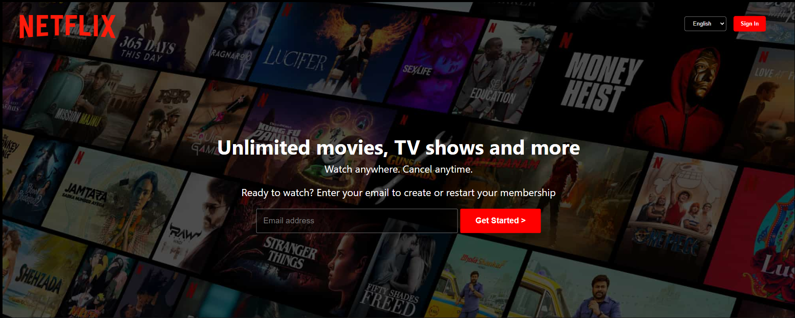
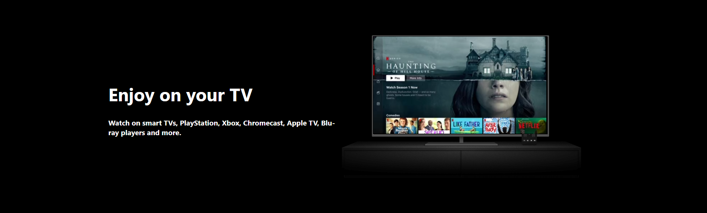
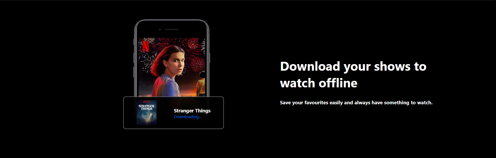
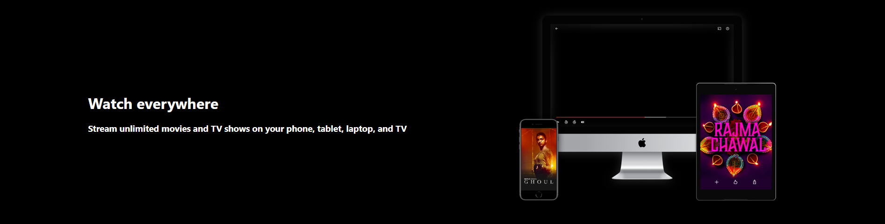
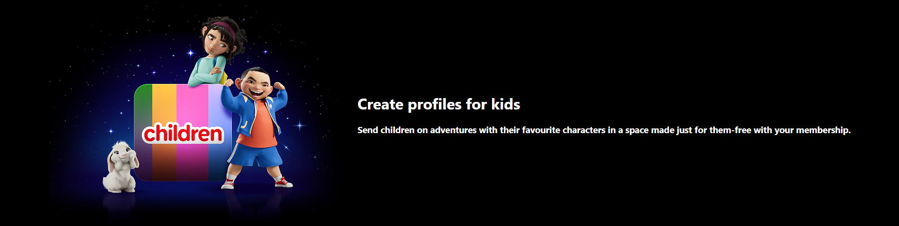
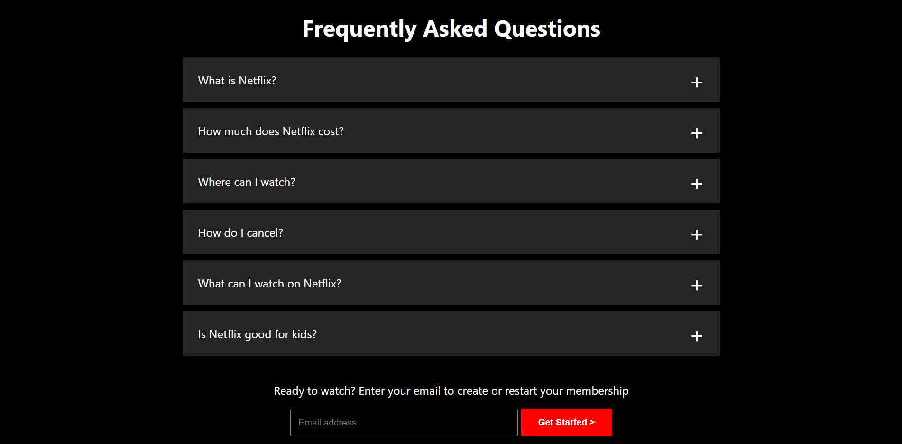
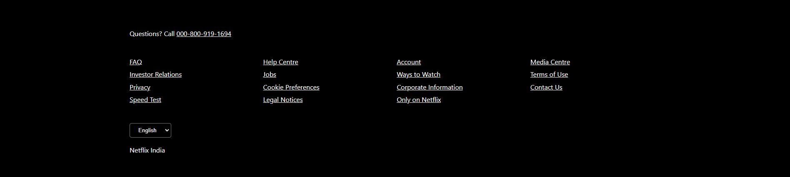

# Netflix India Clone (Front-End)
## Bharat Intern task 3

## Description

Netflix India Clone (Front-End) is a web-based application that replicates the user interface of Netflix's landing page for the Indian audience. It provides a visually appealing and responsive design, featuring elements such as a video background, user sign-in, and FAQs section.

Please note that this project is a front-end clone and does not include any server-side or backend functionality.

## Features

- Video background and striking visuals.
- Language selection and sign-in button (visual representation).
- FAQs section with expandable questions.

## Demo
[Check it out](https://effervescent-stardust-0cf43d.netlify.app/)

## Screenshots

## Usage

1. Open the web page in your browser.

2. Explore the sections, including the video background, information about downloading shows, and frequently asked questions.

## Credits

- Netflix India Clone is inspired by the design of the Netflix landing page for the Indian audience.

## License

This project is open-source and available under the [MIT License](LICENSE).

## Contact

[Pavanananda K S] - [pvn.24.offi@gmail.com]

Project Link: [GitHub Repository](https://github.com/your-username/netflix-india-clone)

Feel free to reach out with any questions or feedback.
